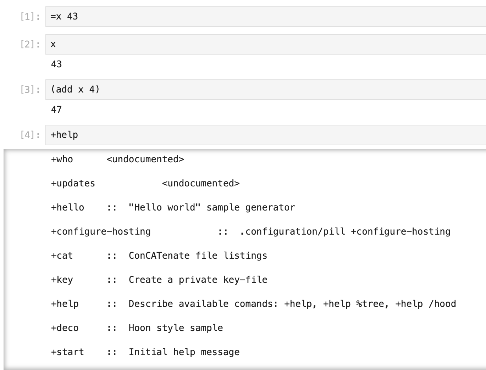

# Jupytur - a Jupyter kernel interface for Urbit


A Jupyter notebook interface to an Urbit development ship using Eyre SSE.

Requires the changes to Dojo in [`urbit/urbit` #7331](https://github.com/urbit/urbit/pull/7331).



## Installation

1. Build and install the ship with the `/app/dojo.hoon` + `/mar/eval-command.hoon` changes.

2. Install the Python kernel.

    ```sh
    git clone https://github.com/sigilante/jupytur.git
    cd jupytur
    pip install -e .
    jupytur-install
    ```

3. Set environment and launch.

    ```sh
    export JUPYTUR_URL=http://localhost:8080
    export JUPYTUR_CODE=lidlut-tabwed-pillex-ridrup
    export JUPYTUR_SHIP=zod
    jupyter notebook
    ```

4. Start a new notebook with the kernel type `Jupytur (Hoon)`.

